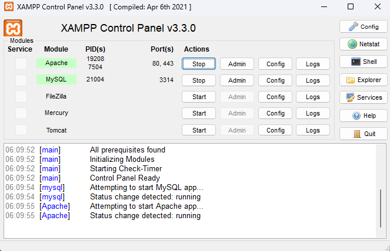

# Sistem Toko Material (MateriArt)

## How to Run

# Sistem Toko Furnitur (WoodWonders)

## How to Run

1. Clone Github Ini

```
git clone https://github.com/Gabrielpjt/TST-toko-material-toko-furnitur.git
```

2. Pindah ke direktori folder

```
cd TST-toko-material-toko-furnitur
```

3. Pastikan [Composer](https://getcomposer.org/download/) dan [XAMPP](https://www.apachefriends.org/download.html) sudah terinstall pada machine anda

4. Jalankan Apache dan MySQL pada XAMPP Anda



5. Buka phpMyAdmin pada http://localhost/phpmyadmin, dan buat database baru bernama tsttokomaterial


6. Pada file .env ubah database.default.port menjadi Port MySQL yang digunakan pada XAMPP

```
database.default.port = Your_XAMPP_MySQL_Port
```

7. Kemudian jalankan perintah

```
composer update
```

8. Jika sudah, jalankan perintah berikut

```
php spark migrate -all
php spark db:seed DBSeeder
php spark serve
```

9. Sistem dapat diakses pada http://localhost:8080
